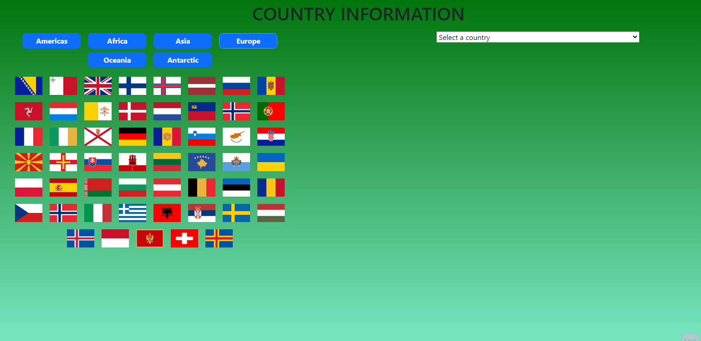

# countryInfo

[Click Here](https://ridvankoseler.github.io/countryInfo/)

👉I tried to do that in this project.👈

👇 
✔Ability to pull data with async.
✔I edited the page with bootstrap instead of style.css in this project.
✔I used "https://restcountries.com/" to get country information on this page.
✔If you click on which country, I transferred the information of that country to the card, you can also select a country from the option section.

